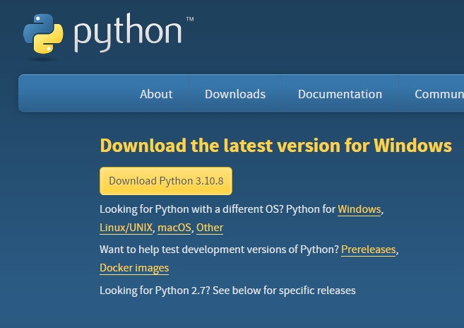

# Capstone for Bachelor of Computer science course 399
# Degree planner for the University of Auckland


## Description
This website allows students to plan out their degrees so that they will know with reasonable certainty that their courses will allow them to graduate and no conflicts or requirements within the courses or their degree aren't met for example forgetting to do their gen ed's.

This website is written in Python for the backend interfacing the database and GUI, SQL is used to get data from the 
database, we use HTML and CSS to create the website pages and these have some Java in them to create the dynamic interfaces.
The python uses the flask framework and the jinja is used to create the pages.

We have also created an application that will allow the university staff to edit what courses are available and remove courses that don't exist or make changes to them. This is in the "GUI for back-end admin updates" folder.

The link to our project management tool is here https://399p-np.atlassian.net/jira/software/projects/PNP/boards/1
The library's that we are useing are in requirements.txt these will be installed for you later in the installation instructions.

## Installation
**Installation Instructions**
Once the project is installed onto your computer, you will need to install python to run it. Install python from this link:

https://www.python.org/downloads/

Install python 3.10.8 onto your computer. The download image should look like this:


Then we need to go to this website: https://www.jetbrains.com/pycharm/download/#section=windows and install the community eddition.
When you open pycharm tell it to open the project by selecting the folder 399capstone-p-np.

Here you should see another version on this readme open up in pycharm. Go to the top right where the big green play button is to the left of that shere should be a drop down click it and select edit configurations.

Under Script path select the script inside the 399 capstone project called wsgi.py and below that in the execution section tick run with python Console. Prees Ok and Agree to close the window.

Now press ctrl-alt-s to open settings and select 399 capstone. select python interpreter and select system interperater and select apply to close the window.

Open the command prompt as administrator and enter the following commands:
py -m pip install flask
py -m pip install python-dotenv
Close the command prompt

Now open the requirements.txt document and right click and select install all. (Or use pip)

Alternatively, you can open the command promp with admin privileges, navigate to the project directory, and then type pip install -r requirements.txt into the command prompt. 

All the files and dependancies have been installed

Now press the green play button to run (In the top right of the screen)


## Execution of the web application

To run the website you must run the file called wsgi.py. This will create the website and post a link to it in the console where you run it. The link for you should be showen below.
````
http://localhost:5000/
```` 

## Data collection

We have collected the data from 
(https://www.calendar.auckland.ac.nz/en/courses/faculty-of-science/chemistry.html). We had to use a web scraper to collect all the data and we are unable to determine what courses are still running but have made it update every year so when the courses change the database is automaticly updated

## Future ideas

To expand upon this website we think that adding a drag and drop system would be ideal to allow users to shift what year a course is in. 

We also think that the data entry is slow and tedious and that a faster way of entering data would be good however we're unsure how to implement this.

Internaly we think that the way data is passed from the GUI to the python isn't correct and needs revisment

We also think that the database's naming and primary key structure needs to be redone and making every course have a number and a degree seperate from each other isn't efficient and has coused many issues and will continue to do so until revised. Although the cost to do that is probably more than the cost to deal with the issues that it generates.


## Acknowledgements
We used the base code from the 235 software devalopment methodologies course.
We also acknowledge the use of team-frogs assignment 2 website where we grabed large amounts of code and adapted them to this project

